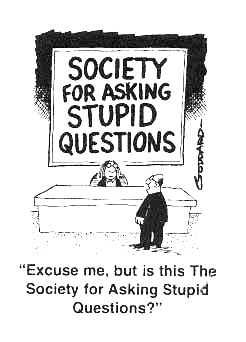

# How to avoid looking stupid 
To form an answer, we have to know what it is that we are trying to answer. In other words, what is the question? We're taught in school that 
"there are no stupid questions" but that's because we rarely hear any. When you're asking a question online directed towards experts, you might want to consider thinking like you're asking the question to a professor. People don't want to answer your question if you never bothered to try anything first. Like in an interview, if you look stupid or sound stupid, you'll be passed over for someone who looks or sounds smart. Following the advice from Eric Raymond's essay, [How To Ask Questions The Smart Way](http://www.catb.org/esr/faqs/smart-questions.html), there are guidelines to be met 
before attempting to ask the question and also when you're in the process of asking the question. Some of these guidelines include trying to find the answer first, choosing which place to ask your question, choosing how to phrase/format your question, providing explicit information, being courteous, etc. Following these simple guidelines will not only ensure that you get your answer, it also ensures that you don't look stupid in front of countless people.

# So... is this stupid question?
Well, the header is sort of a stupid question. If you have to ask yourself if it's a stupid question, it might just be one. What does that mean? Well, did you look up the answer
first before trying to ask it? Here is an [example](https://stackoverflow.com/questions/44001724/xcode-wont-launch) where someone is having a problem with their program and decided to
ask online for someone to help them fix their issue. In this example, the header is not even a question and is left broad, which would draw in very little people wanting to help. 
The person who posed the question has given the error code but it is heavily implied that they did not even try to search 
for what the error means nor how to "clean" their environment. In the answer section, someone even links in the forum to where their question could
have been more relevent and where they would have gotten much better answers if they phrased their problem better.

# Think Smart, Act Smart
The essay mainly goes on to show the guidelines of how to ask a "smart question". This is a question that explicitly shows what the problem is,
what steps were taken in trying to solve the problem, and any useful references such as code or error logs that can help others try to help
answer the question. This [example](https://stackoverflow.com/questions/37711082/how-to-handle-notification-when-app-in-background-in-firebase) here shows a smart question.
The person lists their question explicitly in the header, they showed examples of their code, and they shared information that they at least tried
something before going to ask the question. In this case, the person received several explicit answers that were able to answer his question. This shows that
if you have an effective and smart question, more people will be willing to help you since you at least tried and didn't seem stupid.
