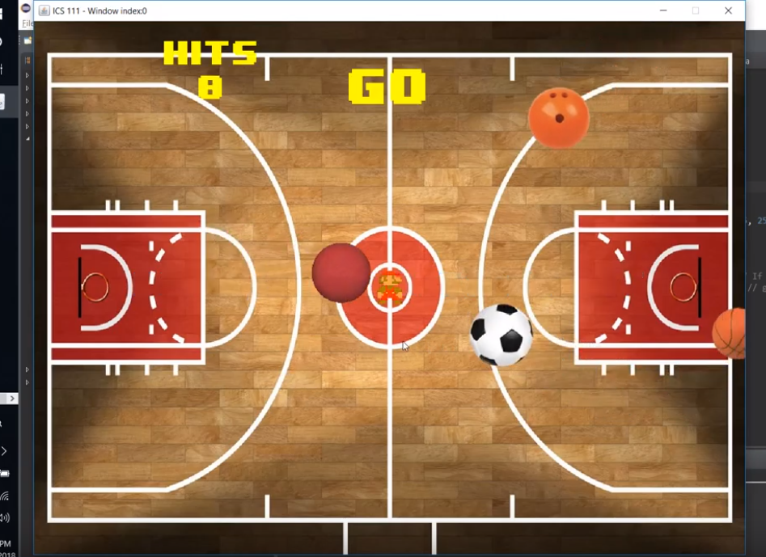

  

This was the first project assigned to us in ICS 111 where we had to make a dodgeball game. We were required to make a hitbox around the player and the balls, such that if the ball made contact with the player, a counter for hits would increment. Once the counter reached 3 hits, the game would end.

This was the first time I had the chance to use the EZLibrary that we were given, which made a lot of the project easy since the methods were given to us and we did not have to implement anything. While it was somewhat easy, there were a lot of things that I had yet to learn so it was a good time to learn about Java such as methods, classes, and objects. This serves as a good memory for me as I didn't really know much about what I was doing and realizing that I have improved a lot since then.
